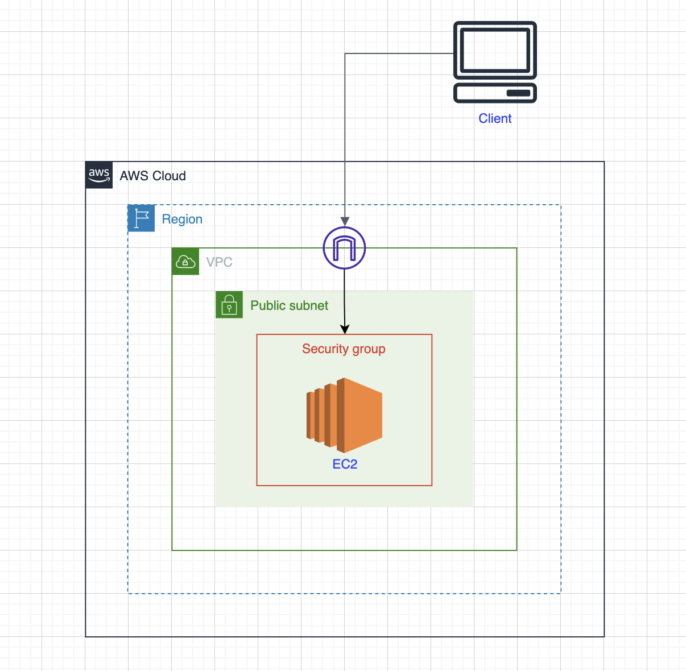
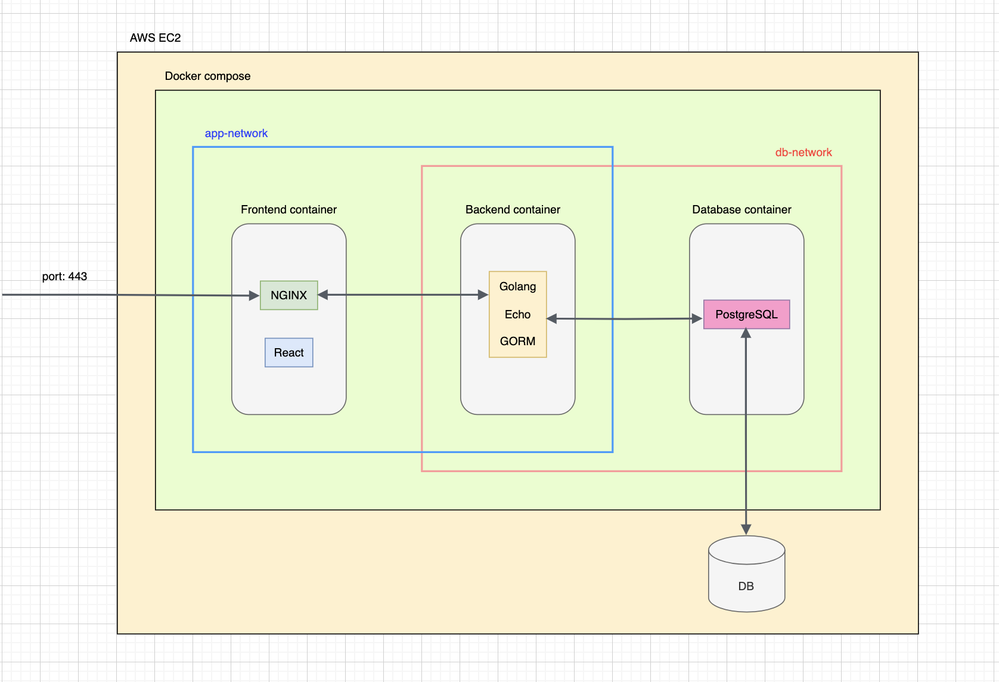

# 人間ドック受付アプリ

このアプリはポートフォリオとして作成しました。

各情報を登録することで、人間ドックの予約を管理することができます。  
また、医療機関へ提出する予約情報をエクスポートすることができます。  

デモ用URL https://app.medicalcheckreception.com/

## 使用技術

### Frontend

- React
- TypeScript
- Vite
- ESLint
- Nginx

### Backend

- Go
- Echo
- GORM
- Air

### Database

- PostgreSQL

### Environment

- Docker
- Docker Compose
- AWS(EC2)

## Server

## 機能一覧

- ログイン/ログアウト
- ユーザー管理
- 管理者権限
- 被保険者、予約枠情報インポート
- 予約情報エクスポート
- 予約受付（登録、変更、削除）
